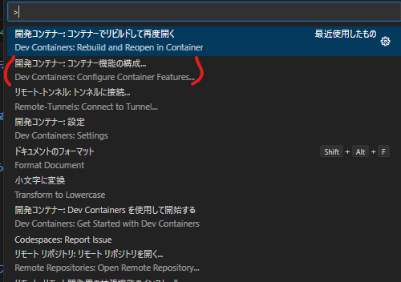

# 「お前もコンテナにしてやろうか」

@ytnobody


---

# @ytnobody


- Y.pm LLC. 代表
- 大井町.pm 主催
- 最近は TypeScript や Rust を触っている
- 副作用の有無で層を分けろおじさん

---


---

# 諸君はこう思ったことはないだろうか？

---

# 「開発環境のセットアップだるい！！！」

---

# 「OS ごとに開発環境のツールチェーンを用意するのめんどくさい！！！」

---

# 「開発環境のセットアップを自動化したい！！！」

---

# 何？開発環境のセットアップの自動化？

---

# なんと、それは実現可能なのだ！

---

# そう、あくまでもデーモンの力を借りればだ…

---

# そのデーモンの名は…

---

# 「Docker」だ！

---

# いやいや待て、諸君。

---

# 今回は Docker の話ではない。あくまで Docker は力の源でしかない。

---

# この Docker デーモンの力を借りて、開発環境のセットアップを自動化する方法があるのだ。

---

# その方法の名は…

---

# devcontainer である！

---

# 諸君の中には、既に devcontainer を使っている者はいるだろうか？

---

# まだ少数派かもしれない。

---

# しかし、これからは devcontainer を使う時代が来るのだ。

---

# まず、このスライドを表示しているのは、revealup というツールである。

---

# revealup は、Markdown をスライド形式で表示してくれる。

---

# なんと perl 製である。作者は@yusukebe 氏である。

---

# devcontainer のはじめ方はとても簡単である。

---

# まず、vscode を起動する。

---

# 次に、dev container という拡張機能をインストールする。


- ms-vscode-remote.remote-containers という ID の拡張機能である。

---

# vscode を再起動する。

---

# devcontainer の力を借りたいプロジェクトを開く。

---

# そして、vscode のコマンドパレットを開く。

---

# コマンドパレットで「開発コンテナー:コンテナー機能の構成」を選ぶ。



---

# 開発環境に入れたいツール類(feature)を選ぶ。


---

# feature はここに一覧がある。

https://containers.dev/features

---

# これで、開発環境のセットアップは完了である。

---

# あとは、コマンドパレットで「開発コンテナー:コンテナーでリビルドして開く」を選ぶ。

---

# これで、開発環境がセットアップされたコンテナーでプロジェクトが開かれる。

---

# なに？もっと細かい設定をしたい？

---

# そういう時は、.devcontainer ディレクトリの中にある devcontainer.json を編集するのだ。

---

# .devcontainer/devcontainer.json には、Dockerfile のパスを指定することができる。

```json
{
  "name": "perl5-devcontainer",
  "dockerFile": "Dockerfile",
  "features": {
    "ghcr.io/devcontainers-contrib/features/perl-asdf:2": {
      "version": "5.36.0"
    }
  },
  "customizations": {
    "vscode": {
      "extensions": [
        "d9705996.perl-toolbox",
        "bayashi.perlcpanfile",
        "GitHub.copilot",
        "GitHub.vscode-pull-request-github",
        "Postman.postman-for-vscode",
        "evilz.vscode-reveal"
      ]
    }
  },
  "remoteEnv": {
    "PATH": "/home/vscode/.asdf/installs/perl/5.36.0/bin:${containerEnv:PATH}",
    "PERL5LIB": "/home/vscode/.asdf/installs/perl/5.36.0"
  }
}
```

---

# Dockerfile の base image には、devcontainer の公式イメージを使うことができる。

```Dockerfile
FROM mcr.microsoft.com/vscode/devcontainers/base:ubuntu-22.04
RUN apt-get update && apt-get install -y \
    build-essential \
    git \
    wget \
    sqlite3 \
    && rm -rf /var/lib/apt/lists/*
```

---

# devcontainer の公式イメージはこちらにある。

https://containers.dev/templates

---

# お前（の開発環境）もコンテナにしてやろうか。

---

# ありがとうございました 🙇‍♂️
