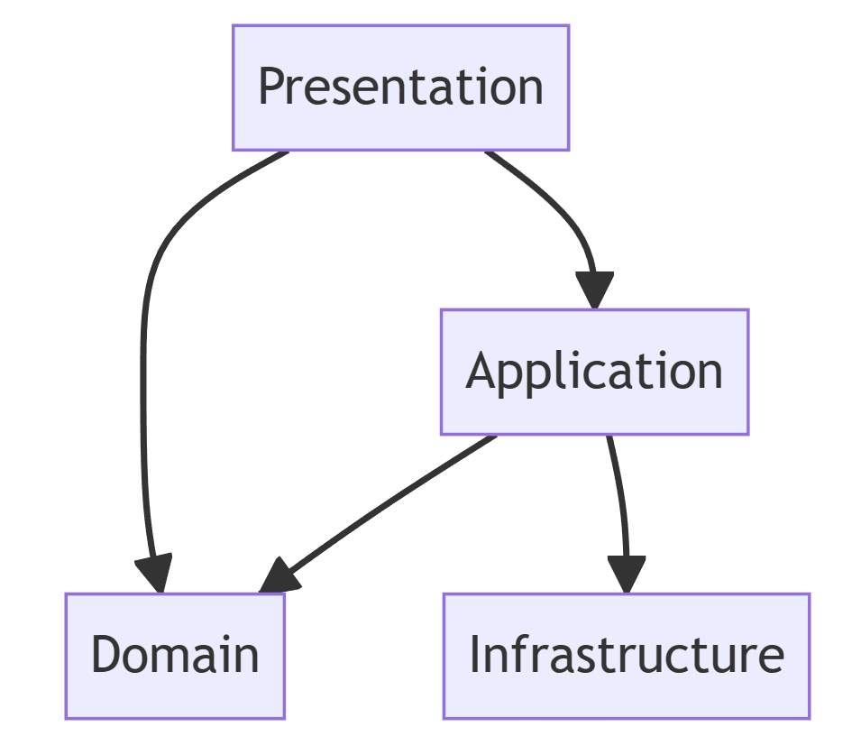
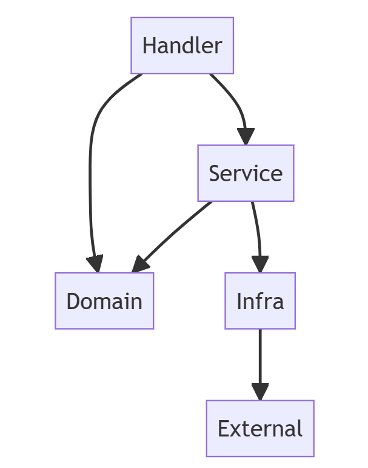

# エンジニア育成に効くかもしれないレイヤードアーキテクチャーっぽいソフトウェア設計

@ytnobody

---

# ytnobody

---

## ytnobody

- As known as わいとん
- Satoshi Azuma
- Born in Hakodate, 1980
- Founder of 大井町pm
- CEO of [Y.pm](https://www.ypm.llc) LLC.
- Rider, Gamer, Hacker, Father

---

## Agenda

- レイヤードアーキテクチャーの概要
- エンジニア育成のむずかしさ
- Y.pm式レイヤードアーキテクチャー
- まとめ

---

# レイヤードアーキテクチャーの概要

---

## レイヤードアーキテクチャー

- DDD(ドメイン駆動設計)の文脈でよく引き合いに出る
  - 今回はDDDについては触れないし説明もしない
- レイヤーを分けてアプリケーションを設計する
- レイヤー間の依存関係は一方向にする
- 依存関係の方向は外側から内側に向かう

---

## よくある図

  

---

## レイヤーの種類

- Presentation または UI
  - ユーザーとのやりとりを担当する
- Application
  - ユースケースを実装する
- Domain
  - ドメインモデルを実装する
- Infrastructure
  - データベースや外部サービスとのやりとりを担当する

---

## ここまでがよくあるレイヤードアーキテクチャー

---

## 個人的な所感

- 用語がわかりにくい
  - 例えば「ドメインモデル」
  - 例えば「ユースケース」
- 用語がわかりにくいので、使い方や実装がわからん

---

# エンジニア育成のむずかしさ

---

# エンジニア育成じゃなくてオブジェクト指向プログラミングのむずかしさ

---

## オブジェクト指向プログラミングが難しい

- 種類が色々
  - クラスベース
  - プロトタイプベース
  - マルチパラダイム

---

## インスタンス内部に状態を持つことの難解さ

- アクセス権（ない言語もある）
- メソッドの呼び出し順序
  - メソッドの呼び出し順序による結果の変化
- メソッドの呼び出し順序を制御することの難しさ
  - メソッドの呼び出し順序を制御することの難しさによる結果の変化

---

## インスタンス間の状態の共有の難解さ

- インスタンス間の状態による結果の変化
- インスタンス間の状態を制御することの難しさ
  - インスタンス間の状態を制御することの難しさによる結果の変化

---

## 継承の難解さ

- 最近は継承を使わない方がいいという言説もある
- 実際継承は難しい
  - 多重継承
  - ダイヤモンド継承
  - プロトタイプベースの継承

---

## 移譲をしても難しい

- 移譲をすると、移譲先のインスタンスの状態によって結果が変わる
- 移譲先のインスタンスの状態を制御することの難しさによる結果の変化

---

## まとめると

- オブジェクト指向プログラミングは状態を内包するので難しい
- 状態を内包すると、状態によって結果が変わるので難しい
- 状態を制御することがそもそも難解
- 移譲・継承・状態内包・アクセス権など多機能ゆえに難しい
- あと、思っている以上にクラスの流用は行われない

---

## 初学者を採用して育てるのであれば

- いっそオブジェクト指向プログラミングを捨てて良いのでは？
- 手続き型 + 名前空間でいいのでは？
- そもそもオブジェクト指向プログラミングは難しいので、初学者には向かない
- 状態を内包した変数を捨てることで、初学者がプログラミングを学ぶのに必要な概念を減らせるのでは？

---

# Y.pm式レイヤードアーキテクチャー

---

## Y.pmの事情

- 零細企業。人数も資金も少ない。
- フルリモート。社員は遠方に住んでいる。
- 人材不足。カネもないので、東京のエンジニアを採用するのはまず無理。

---

## わいとん「よし、地方の初学者を育成していくぞ」

---

## わいとん「オブジェクト指向プログラミングは教えるのが難しいから、捨てて良いべ」

---

## わいとん「オブジェクト指向プログラミングを捨てると、初学者でも比較的早めに成果を出せるようになるべな」

---

## と言いながら1年が経過し、蓄積されたノウハウの一つ

---

## それがY.pm式レイヤードアーキテクチャー

---

## 特徴

- オブジェクト指向プログラミングの手法を捨てた
- 状態を内包した変数を捨てた
- 純粋関数と非純粋関数とデータ構造を明確に分離した
- レイヤー間の依存関係を徹底的に一方向にした

---

## レイヤーの種類

- Handler
  - 呼出し可能な機能のルーティングを担当する
- Service
  - 非純粋関数で構成される機能を実装する
- Domain
  - 純粋関数で構成される機能を実装する
  - 定数もここに含まれる
- Infra
  - 外部サービスとのやりとりを担当する
- (Types)
  - 型情報はここ。どこから参照しても良い。

---

## レイヤーの依存関係

  

---

## コード例

demo time

---

## 純粋関数と非純粋関数

- 純粋関数
  - 引数によって結果が変わる
  - 引数以外の外部状態によって結果が変わらない
- 非純粋関数
  - 引数によって結果が変わる
  - **引数以外の外部状態によって結果が変わる**

---

## Domainを徹底的にテストせよ

- Domainは純粋関数で構成される
- 純粋関数は引数によって結果が変わる
- 引数以外の外部状態によって結果が変わらない
- テストしやすい

---

## Serviceはテストしにくい

- Serviceは非純粋関数で構成される
- 非純粋関数は引数によって結果が変わる
- **引数以外の外部状態によって結果が変わる**
- テストしにくい

---

## なるたけDomainに処理を寄せる

- Service内の副作用を持たない簡単な処理はDomainに寄せる
- Domainに寄せたらテスト！テスト！テスト！

---

## Domainに持っていくとよいもの

- エラー処理
- バリデーション
- データ変換
- 状態から結果を導く処理
  - 例えば、ユーザーの状態からユーザーの権限を導く処理
- ORMに渡すためのパラメータの組み立て
- SQLの組み立て

---

## 補助的に追加されうる要素

- Transactionレイヤー
  - DBトランザクションをともなう処理
  - 複数サービスを横断的に使う処理
  - Handlerから依存される
  - ServiceとDomainに依存する

---

## まとめ

- オブジェクト指向プログラミングの難しさを回避することで初学者でもいち早く成果を出せるようになる
- 純粋関数と非純粋関数を明確に分離することで、複雑さを減らせる
- レイヤー間の依存関係を徹底的に一方向にすることで、調査の難しいバグを減らせる
- これらの特徴はエンジニア育成に効く

---

## Any Questions?
